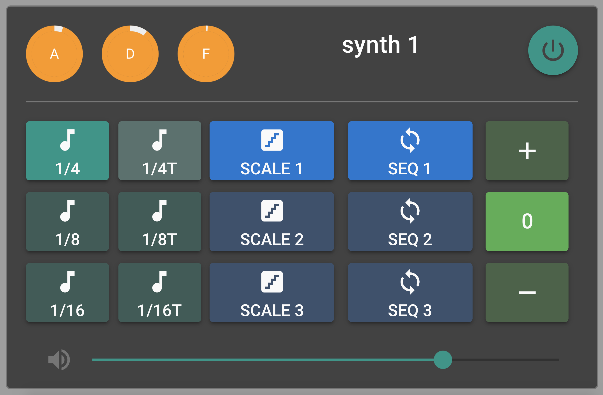

# Arpeggiata (arpeggiata)

Arpeggiata is a modular arpeggio engine based on the
[Quasar](https://quasar.dev/) framework.

You can install it for yourself or check out a live demo at
[arpeggiata.tk](http://arpeggiata.tk/)!

## Usage

Arpeggiata consists of four independent synth modules, each with the following features:

- **power button:** toggle mute
- **A/D knobs:** attack and decay for the amplitude envelope,
- **F knob:** cutoff frequency for the lowpass filter,
- buttons for choosing the **note value** of the arpeggio,
- buttons for choosing one of three user-defined **scales** and **sequences**,
- buttons for modifying the **octave** (_+/0/-_).



All four synth components are tied to a global clock with start/stop buttons and
changeable tempo.

### Scales and Sequences

Arpeggiata's defining feature is its ability to independently define scales and
sequences: while a scale is a list of notes and/or frequencies, a sequence
defines the order in which the notes of a scale are triggered.

```javascript
let majorScale = ["C4", "D4", "E4", "F4", "G4", 440.0, "B4", "C5"];
let sequence = [1, 3, 5, 3];
```

Here, the C major scale is paired with a sequence that would result in an
up/down arpeggio of a C major chord. Note that both note/octave string notation
and integers/floating point numbers can be used to define a scale's note.

If we were to change the scale, for example to C minor, the same sequence would
result in a C minor chord.

```javascript
let minorScale = ["C4", "D4", "Eb4", "F4", "G4", 440.0, "B4", "C5"];
```

If a sequence element exceeds the scale's array size, it gets wrapped back to
the start of the scale. Note also that scale indices begin at one, not at zero:

```javascript
majorScale[1]; // C4
majorScale[10]; // D4
```

## Installing

Navigate to the base project directory:

```bash
cd arpeggiata
```

Install the dependencies:

```bash
npm install
```

Start the app in development mode (hot-code reloading, error reporting, etc.):

```bash
quasar dev
```

Build the app for production:

```bash
quasar build
```

## License

Arpeggiata was developed as part of a student project at the [Institute of
Electronic Music and Acoustics](https://iem.kug.ac.at/) in Graz, Austria.

It is distributed under the [GNU General Public License
v3.0](https://www.gnu.org/licenses/gpl-3.0.en.html).
